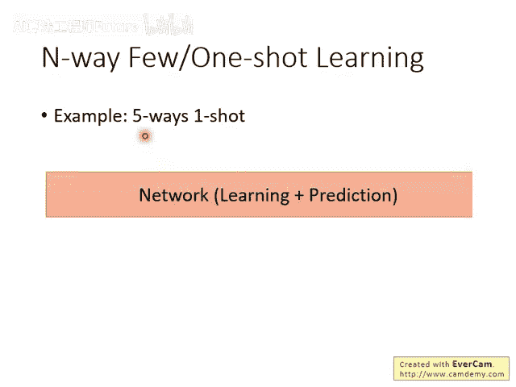
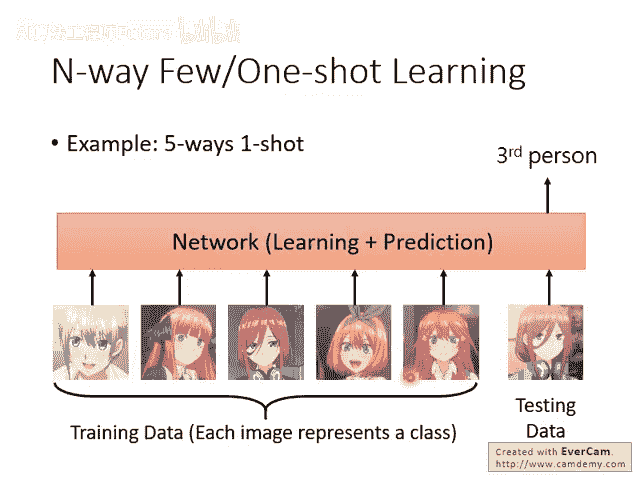
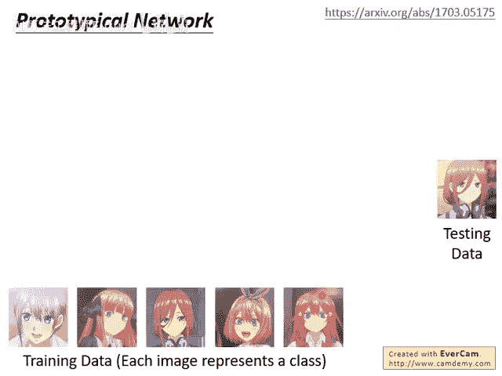
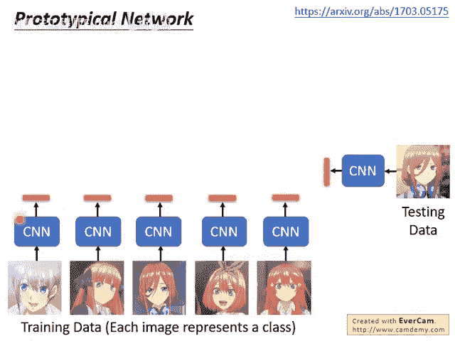
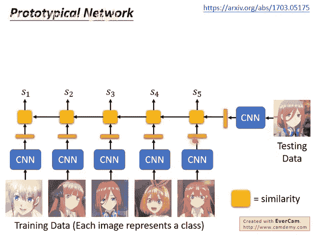
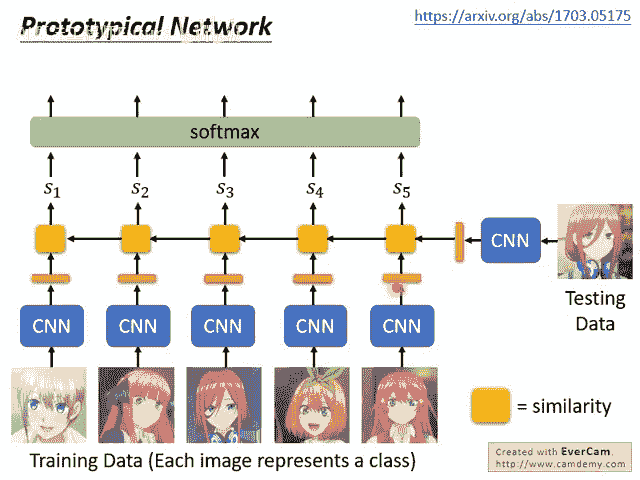
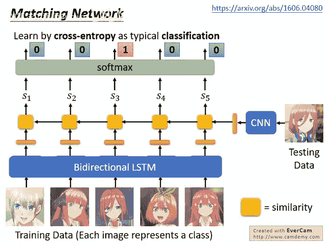
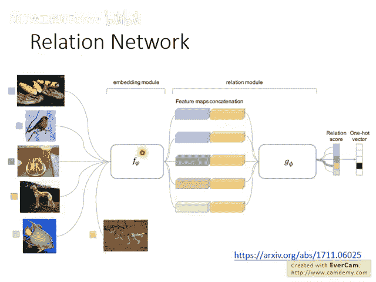
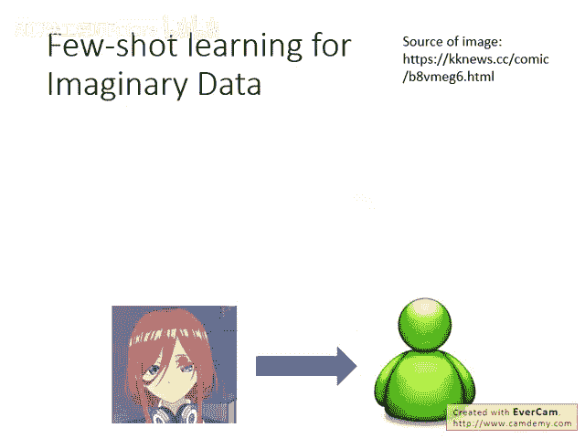
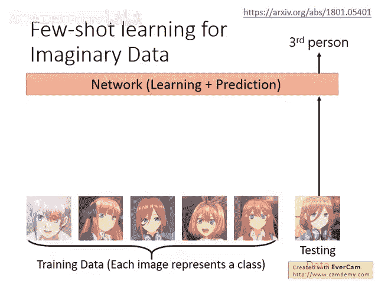

# 108：李宏毅机器学习108 - 18-Meta Learning – Metric-based (3-3) 📚

在本节课中，我们将要学习基于度量的元学习（Metric-based Meta Learning）在**多类别分类任务**中的应用。我们将探讨如何将之前学到的概念，从简单的“是/否”验证问题，扩展到更复杂的“五路单样本”（Five-way One-shot）分类场景。

上一节我们介绍了基于度量的元学习在验证任务中的应用，本节中我们来看看如何将其应用于识别任务。

## 从验证到识别 🔄

之前举的例子中，我们的训练资料都只有一张，任务是验证（Verification），即回答“是”或“否”。现在，如果要做的是识别（Identification），即一个多类别分类问题，该怎么办呢？

举例来说，假设我们现在要把同样的概念用在“五路单样本”（Five-way One-shot）任务上。

## 理解“五路单样本”任务 🖐️

“五路单样本”任务是指我们有五个类别（class），但每个类别我们只有一个示例（example）。这被称为“五路单样本”（Five-way One-shot）。

在任务中，我们有五个类别。假设这五个类别是“五等分的花嫁”中的五姐妹，每个人代表一个类别。她们分别是一花、二乃、三玖、四叶和五月。每个角色就是一个类别，现在每个角色只有一张图片。

网络需要将这五张图片作为输入。测试时，给它一张新图片，它需要自动判断这张图片属于刚才给出的五个类别（每个类别只给一张图片）中的哪一个。

## 网络架构设计 🧠

实际上，网络架构在文献中有很多做法。以下是几种经典方法：

### 原型网络（Prototypical Network）

一个经典的做法叫做**原型网络**。它做的事情与我们之前讲的孪生网络（Siamese Network）非常相似，只是现在从输入一张训练数据，扩展到输入多张训练数据。

以下是其核心流程：

1. 我们用一个CNN将每张训练图片（Training Image）变成一个嵌入向量（Embedding Vector）。
2. 测试图片（Testing Image）也通过同一个CNN变成嵌入向量。
3. 接下来，我们计算测试图片的向量与每个训练图片向量的**相似度**。

我们用黄色方块代表计算相似度这件事。这个图表示我们拿测试向量分别与一花、二乃、三玖、四叶、五月的向量计算相似度。这样我们就得到五个相似度的值，记为 ( s_1 ) 到 ( s_5 )。

1. 接下来，你可以将这五个相似度值输入一个Softmax层。
2. 在训练时，损失函数（Loss Function）与一般的分类问题一样。

具体来说，一般做五分类问题时，你会通过Softmax输出五个值，然后计算交叉熵（Cross Entropy）并最小化它。这里做的事情一模一样：你也有五个值（相似度得分），通过Softmax后，一样计算交叉熵。其目标（Target）是：假设这张测试图片是三玖，那么第三个类别的目标是1，其他都是0。你就计算Softmax层的输出与这个目标之间的交叉熵，并在训练时最小化它。

**核心公式**（损失函数）：  

[  

\mathcal{L} = -\sum_{i=1}^{5} y_i \log(p_i)  

]  

其中，( y_i ) 是真实标签（one-hot向量），( p_i ) 是Softmax输出的第 ( i ) 个类别的概率。

如果每个类别不止一张图片（Few-shot），处理方式也很简单。在原型网络中，假设你有三个类别，每个类别有五张图片，你就把这五张图片的嵌入向量**平均**起来，得到该类别的“原型”（Prototype）。测试时，看测试向量与哪个类别的原型最相似，就属于哪个类别。

这个方法非常直观，道理与孪生网络差不多：希望测试数据如果属于类别二，那么它就跟类别二的那些图片的平均（原型）越接近越好，同时与其他类别的原型远离。

### 匹配网络（Matching Network）

还有一个很类似的做法叫做**匹配网络**。它与原型网络最不一样的地方在于：之前我们是把训练数据里的每一张图片分开处理。匹配网络认为，训练数据里的图片互相之间可能也有关系。

所以，它使用一个**双向LSTM**（Bi-directional LSTM）来处理这些训练图片。训练图片通过双向LSTM后，每张图片仍然会得到一个嵌入向量，接下来的做法（计算相似度、Softmax分类）就跟原型网络一样了。

事实上，在历史演进上是先有匹配网络，后有原型网络。原型网络的论文中提到，他们认为在这里使用双向LSTM好像不是很有道理。因为如果用双向LSTM，那么输入训练资料的顺序（例如把二乃和三九的顺序对调）可能会影响网络的输出，这显得有些奇怪。

此外，匹配网络在计算出这些相似度分数以后，其实还通过一个“多头注意力”（Multiple Hop）的处理过程才得到最终输出。这个过程与记忆网络（Memory Network）中用到的过程类似。不过因为这门课没有讲记忆网络，这部分我们就略过，有兴趣可以自行查阅论文。

### 关系网络（Relation Network）

还有别的网络，比如**关系网络**。关系网络与刚才的网络道理也都一样：输入训练资料，输入测试资料，然后当做一个分类问题来做，判断测试资料属于哪一个类别。

关系网络与匹配网络、原型网络有个不一样的地方。它的不同之处在于：

1. 它先把训练资料里的每一张图片，以及测试资料，都抽出它们的嵌入向量。
2. 然后，它将测试资料的嵌入向量，与每一张训练资料的嵌入向量进行**拼接**（Concatenate）。
3. 在匹配网络和原型网络中，都是直接计算两个向量的**余弦相似度**或**欧氏距离**。关系网络则认为，相似度不是预先定义的，而是用**另外一个神经网络**计算出来的。

这个额外的神经网络（称为关系模块，Relation Module）把拼接后的向量吃进去，用它自己的方法来计算这两个向量有多“像”。这个“像”的程度（即关系分数）不是简单的距离，而是通过网络学习得到的。

**核心思想**：如何抽取嵌入向量，以及如何计算“相似度”（关系），是**一起被学出来**的。

## 数据增强：让机器“想象” 🧠✨

我们知道，在少样本学习（Few-shot Learning）中常常遇到的问题就是训练资料很少。那么怎么办呢？我们也可以让机器自己去“幻想”出一些训练资料。

人都有想象的能力。虽然只给你看一张三玖面无表情的脸，但也许你可以想象她害羞、生气或卖萌的样子。所以我们看到一张人脸，可以想象出他的其他面相。我们能不能让机器也做一样的事情呢？

在文献上确实有这样的做法。原来我们做单样本学习时，每个类别就是一张图片。现在，我们引入一个**生成器**（Generator）。

虽然我们还没有详细讲过生成技术，但你可以想象，有一些技术可以训练一个生成器去产生东西。现在，我们训练一个生成器，它吃一张图片进来，就产生一大堆它觉得相关的图片。

这个生成器就像是人的想象力一样。但它怎么被训练出来呢？它是跟后面那个分类网络**一起联合训练**的。

具体来说，我们可以先设定好这个生成器：给它一张图片，让它另外生成三张。例如，给它一张人脸，它可能就会想象出那个人生气、害羞和卖萌的样子。然后，把这些“想象”出来的脸也丢到分类网络里，参与接下来的训练。

**核心流程**：

1. 输入一张真实图片。
2. 生成器（Generator）根据该图片生成多张“想象”的变体图片。
3. 所有图片（真实+生成）一起用于训练后续的分类网络。
4. 生成器和分类网络**联合训练**，目标是提升最终的分类性能。

这就是“少样本学习的想象数据”（Few-shot Learning for Imaginary Data）的基本思想。

---

本节课中我们一起学习了如何将基于度量的元学习应用于多类别识别任务。我们介绍了**原型网络**、**匹配网络**和**关系网络**等经典方法，它们通过计算嵌入向量间的相似度来解决少样本分类问题。此外，我们还探讨了通过引入**生成器**来让机器“想象”更多训练数据，以缓解数据稀缺的挑战。这些方法为在仅有极少样本的情况下进行有效学习提供了强大的思路和工具。
