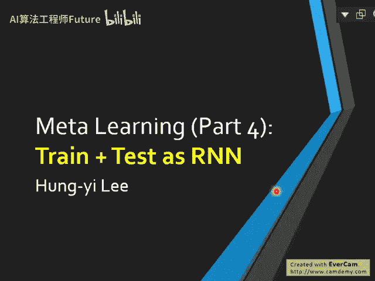
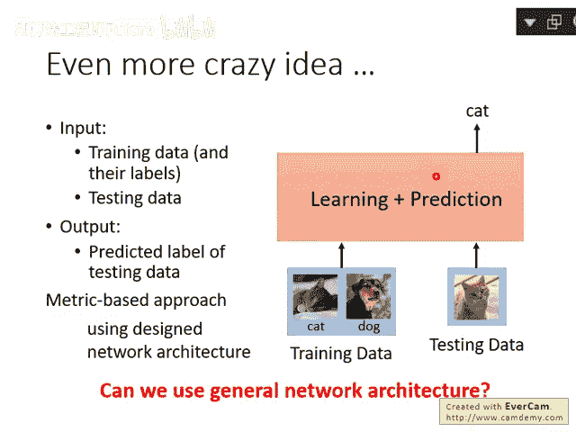
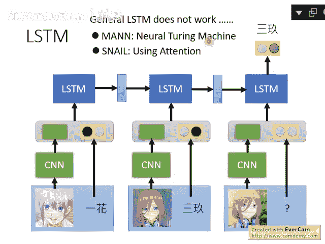

# 109：19-Meta Learning - Train+Test as RNN 🧠➡️🤖

## 概述

在本节课中，我们将要学习元学习（Meta Learning）的另一种视角：将训练（Train）和测试（Test）过程整合到一个循环神经网络（RNN）中。我们将探讨这种方法的动机、实现思路、遇到的挑战以及最终的解决方案。

---

## 元学习的另一种视角

上一节我们介绍了基于度量（Metric-based）的元学习方法，如孪生网络（Siamese Network）。本节中我们来看看一个更通用的想法：能否设计一个函数，同时完成学习和测试？

这个想法是寻找一个函数。该函数能够接收训练数据和测试数据作为输入，并直接输出测试数据的答案。这听起来很复杂，因此之前我们介绍的方法（如孪生网络、原型网络）都设计了特定的网络架构来实现这个目标。

那么，是否有人尝试过使用一个通用的网络架构来完成这件事呢？

## 使用通用RNN的尝试

有人尝试直接使用一个通用的循环神经网络（RNN）来解决这个问题。网络的输入是训练数据和测试数据组成的序列，输出则是测试数据的标签。

具体来说，对于图像分类任务，每笔训练数据包含一张图片和其对应的类别标签。我们需要将图片和标签编码（Embedding）后输入RNN。

以下是处理输入数据的一个示例流程：

1. 使用卷积神经网络（CNN）处理图片，得到一个特征向量。
2. 将类别标签用独热编码（One-hot Vector）表示。
3. 将图片特征向量和类别独热向量连接（Concatenate）起来，形成一个特征向量，输入到RNN（如LSTM）中。
4. 对于测试数据，由于我们不知道其标签，可以用零向量（Zero Vector）来表示其类别部分。
5. 将训练数据和测试数据按顺序组成一个序列，输入LSTM，并训练网络输出测试数据的标签。

然而，实验表明，使用标准的LSTM网络无法成功训练出这样的模型。

## 改进的架构：SNAIL

既然通用的LSTM无法奏效，研究者便开始修改网络架构。其中两个知名的例子是MANN（使用神经图灵机）和SNAIL。

SNAIL是Simple Neural Attentive Meta Learner的缩写。它的核心思想与我们之前描述的尝试完全一致，即将训练数据和测试数据作为序列输入。关键的不同在于，SNAIL不是一个单纯的RNN，它在网络中引入了注意力（Attention）机制。

以下是SNAIL中注意力机制的工作方式：

- 当输入第二笔训练数据时，网络会关注（Attend）之前已输入的第一笔数据。
- 当输入第三笔训练数据时，网络会关注前两笔数据。
- 当输入测试数据时，网络会关注所有已输入的训练数据。

仔细思考，这个行为与匹配网络（Matching Network）或原型网络（Prototypical Network）非常相似。它们本质上都是计算测试数据与训练数据之间的相似度。虽然出发点是想用最通用的方法解决元学习问题，但最终改进的架构在理念上与基于度量的方法殊途同归。

文献显示，SNAIL在性能上表现优异。在Omniglot和Mini-ImageNet数据集上的少样本学习（Few-shot Learning）任务中，SNAIL的表现均优于多个基线模型。

## 总结

本节课中我们一起学习了元学习的一种整合视角：将训练和测试过程视为一个序列处理问题，并尝试用RNN来解决。我们发现，直接使用通用LSTM架构难以成功，而通过引入注意力机制改进的架构（如SNAIL）则能有效工作，并且其核心思想与之前学习的基于度量的元学习方法相通。这展示了解决同一问题的不同技术路径如何最终汇聚到相似的理念上。
