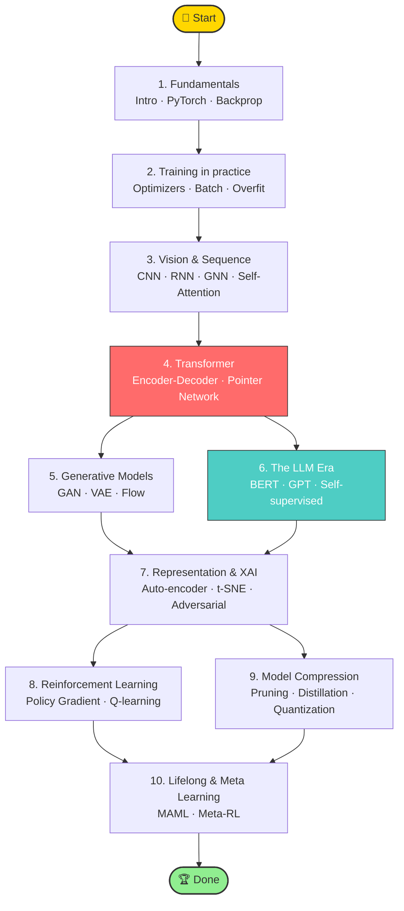

<div align="center">

[简体中文](./README.md) · [English](./README.en.md)


# 🧠 LeeML-Notes-2026

### Hung-yi Lee's most-loved 2026 ML/DL course, broken into 110 weekly-readable chapters

[](./LICENSE)
[](https://github.com/GouBuliya/LeeML-Notes-2026/stargazers)
[](https://github.com/GouBuliya/LeeML-Notes-2026/network)
[](https://github.com/GouBuliya/LeeML-Notes-2026/commits)
[](#-contributing)

📖 **110 chapters** &nbsp;·&nbsp; 🖼️ **4700+ slide screenshots** &nbsp;·&nbsp; 🚀 **PyTorch / Transformer / GAN / BERT / RL** &nbsp;·&nbsp; 🎯 **From zero to LLMs**

</div>

> [!IMPORTANT]
> **Notes are written in Simplified Chinese.** This repo is the most polished open-source companion to Prof. Hung-yi Lee's 2026 ML course (NTU). If you can read Chinese — or you're happy with auto-translation in your browser — you'll find this the cleanest, most navigable version of his notes anywhere on GitHub.

---

## ✨ Why this repo?

Prof. Hung-yi Lee's lectures are widely regarded as **the best Chinese-language ML course in the world**. The problem: 14+ hours of video, no chapter index, slides scattered across PDFs. This repo solves that.

| Pain point | What this repo gives you |
|---|---|
| 🥲 14h of video, no clear entry point | ✅ 110 progressive chapters, ordered from "what is ML" → Transformer → LLMs → RL → meta-learning |
| 🥲 Slide screenshots without context | ✅ Plain-language explanation of every slide, with formulas + code + figures |
| 🥲 Image links break offline | ✅ All 4700+ figures are local — clone once, read forever |
| 🥲 No idea what to skip | ✅ Three suggested learning paths: 7-day fastlane / 30-day systematic / 60-day research |
| 🥲 No way to verify learning | ✅ All 14 official assignments included with Colab notebook references |

---

## 🗺️ Learning roadmap



---

## 📚 Eight modules at a glance

| # | Module | Lectures | Highlights |
|---|---|---|---|
| 1 | 🎯 **Fundamentals** | 1-12 | Intro · PyTorch · Backprop · Logistic Regression |
| 2 | ⚡ **Training in practice** | 13-23 | Optimizers · Adam · Batch & Momentum · Overfitting |
| 3 | 🖼️ **Vision & Sequence** | 24-35 | CNN · RNN · GNN · Self-Attention |
| 4 | 🤖 **Transformer** | 36-41 | Encoder · Decoder · Pointer · Non-Autoregressive |
| 5 | 🎨 **Generative Models** | 42-51 | GAN · VAE · Flow-based |
| 6 | 🧬 **BERT / GPT / Self-supervised** | 52-59 | BERT pre-training · GPT-3 · Variants |
| 7 | 🔍 **Representation · XAI · Adversarial** | 61-75 | Auto-encoder · t-SNE · Domain Adaptation · Attacks |
| 8 | 🎮 **RL · Compression · Meta** | 76-110 | Policy Gradient · Q-Learning · Pruning · MAML |

> Browse the [Chinese README](./README.md) for the curated chapter highlights and full chapter list.

---

## 🛤️ Three learning paths

| Path | For | Time | Route |
|---|---|---|---|
| 🚀 **7-day fastlane** | Already know Python + linear algebra, want LLM intuition fast | 1 week / 1.5h per day | Modules 1 → 2 → 4 → 6 |
| 📚 **30-day systematic** | Junior CS student / new ML engineer | 1 month / 1h per day | All 8 modules in order, all assignments |
| 🎓 **60-day research** | Preparing for grad school / publishing | 2 months / 1.5h per day | All 110 chapters + recommended papers + Colab reproductions |

---

## 🛠️ How to read

| Setting | Recommended | Notes |
|---|---|---|
| 📱 Casual reading | **GitHub web** | Math + figures render natively |
| 💻 Deep study | **VSCode + Markdown All in One** | Full-text search across all chapters |
| 🧩 Knowledge graph | **Obsidian / Logseq** | Open the cloned folder as a vault |
| 🖨️ Print | **Pandoc → PDF** | `pandoc *.md -o leeml.pdf --pdf-engine=xelatex` |

```bash
# Clone offline (~196 MB with all hi-res slides)
git clone https://github.com/GouBuliya/LeeML-Notes-2026.git
cd LeeML-Notes-2026
```

---

## 🌟 Companion resources

- 🎬 **Course videos** — [Prof. Hung-yi Lee on YouTube](https://www.youtube.com/c/HungyiLeeNTU)
- 🎞️ **Official slides** — [speech.ee.ntu.edu.tw/~hylee](https://speech.ee.ntu.edu.tw/~hylee/index.html)
- 💻 **Assignment Colabs** — referenced inside each "Homework" chapter
- 📦 **Pair with** — [pytorch/examples](https://github.com/pytorch/examples) for hands-on code

---

## 🤝 Contributing

PRs welcome — even for typos.

- 🐛 Found something wrong? Open an [Issue](https://github.com/GouBuliya/LeeML-Notes-2026/issues/new)
- ✍️ Want to add content? See [CONTRIBUTING.md](./CONTRIBUTING.md)
- 💬 Got a question? Use [Discussions](https://github.com/GouBuliya/LeeML-Notes-2026/discussions)
- ⭐ The simplest way to support: **drop a Star**

---

## 📈 Star History

<a href="https://star-history.com/#GouBuliya/LeeML-Notes-2026&Date">
  
</a>

---

## 🙏 Acknowledgements

This repo organizes and reformats Chinese notes already in the public domain. All credit goes to:

- **Prof. Hung-yi Lee** (National Taiwan University) — original course author. All slides, figures, and intellectual content belong to him.
- **龙哥盟 (Dragon League)** at [cnblogs.com/geekdoc](https://www.cnblogs.com/geekdoc) — original Chinese transcription.
- **OpenDocCN** ([@OpenDocCN](https://github.com/OpenDocCN)) — image mirror.

> This repo only adds **chapter splitting + formatting cleanup + image localization**. It claims no rights over the underlying content. If the original author has any concerns, please open an Issue and I'll act immediately.

---

## 📜 License

- **Repository structure & formatting** — [CC BY-NC-SA 4.0](./LICENSE) (Attribution · Non-Commercial · Share-Alike)
- **Course content (text / figures / equations)** — © Prof. Hung-yi Lee & National Taiwan University, included under educational fair use
- **Commercial use prohibited** (no paid courses, paid communities, or resale)

---

<div align="center">

**If this saved you hours, please drop a ⭐ — that's the biggest encouragement I can ask for**

<sub>Made with ❤️ by ML learners, for ML learners</sub>

</div>
