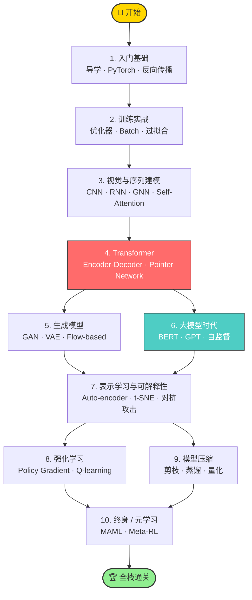

<div align="center">

[简体中文](./README.md) · [English](./README.en.md)


# 🧠 LeeML-Notes-2026

### 把全网最受欢迎的 AI 中文公开课，拆成可以"周更打卡"的 110 个独立章节

[](./LICENSE)
[](https://github.com/GouBuliya/LeeML-Notes-2026/stargazers)
[](https://github.com/GouBuliya/LeeML-Notes-2026/network)
[](https://github.com/GouBuliya/LeeML-Notes-2026/commits)
[](#-贡献)

📖 **110 章** &nbsp;·&nbsp; 🖼️ **4700+ 配图** &nbsp;·&nbsp; 🚀 **PyTorch / Transformer / GAN / BERT / RL** &nbsp;·&nbsp; 🎯 **从 0 基础到大模型**

</div>

---

## ✨ 这份笔记到底好在哪？

> 同样是李宏毅老师的课，B 站找视频要拉进度，PDF 讲义没目录，搜博客一篇只讲一节——
> 你需要的是一份**能从头到尾刷完的"知识地图"**。

| 你之前的痛 | 这里给你的解 |
|---|---|
| 🥲 课程视频 14 小时不知从哪开始 | ✅ 110 章渐进式目录，按"导学 → Transformer → 大模型 → RL → 元学习"线性递进 |
| 🥲 看 PDF 截图找不到上下文 | ✅ 每章都用**大白话**解释每张幻灯片在讲什么，公式 / 代码 / 图配齐 |
| 🥲 想离线看，但图都挂在外网 | ✅ 4700+ 课程截图全部本地化，clone 即可断网阅读 |
| 🥲 不知道哪些是重点哪些可跳 | ✅ 给出 **7 天速通 / 30 天系统 / 60 天科研** 三条学习路径 |
| 🥲 学完不知道怎么验证 | ✅ 14 次官方作业说明全部收录，配 Colab 教程 |

---

## 🗺️ 学习路线图



---

## 📚 八大模块速览

> 点击模块名展开,可跳转到该模块的所有章节;模块下方列出**最值得先看的 3 章**。

<details open>
<summary><b>🎯 模块 1 · 入门基础</b> &nbsp;<i>(第 1 - 12 讲)</i></summary>

> 数学最少、信息密度最高的入门段。零基础也能看懂"机器学习到底是在干嘛"。

- [1. 导学与课程大纲概述](./001-导学与课程大纲概述_.md) ⭐
- [2. 机器学习基本概念（上）](./002-机器学习基本概念上_.md) ⭐
- [4. PyTorch 入门教程](./004-PyTorch_入门教程_-_1_.md) ⭐
- [完整列表 →](#完整目录)

</details>

<details>
<summary><b>⚡ 模块 2 · 训练实战</b> &nbsp;<i>(第 13 - 23 讲)</i></summary>

> 模型 train 不起来?过拟合怎么救?这一段讲透。

- [13. 机器学习任务攻略](./013-第2讲_-_机器学习任务攻略_.md) ⭐
- [16. 自适应学习率](./016-自适应学习率_.md) ⭐
- [21. 深度学习新的优化器](./021-深度学习新的优化器_.md) ⭐
- [完整列表 →](#完整目录)

</details>

<details>
<summary><b>🖼️ 模块 3 · 视觉与序列建模</b> &nbsp;<i>(第 24 - 35 讲)</i></summary>

> 从 CNN 到 Self-Attention,理解"为什么 Attention 几乎一统江湖"。

- [24. 卷积神经网络（CNN）详解](./024-卷积神经网络CNN详解_.md) ⭐
- [29. 自注意力机制（Self-attention）上篇](./029-自注意力机制_Self-attention_上篇_.md) ⭐
- [33. 图神经网络（GNN）基础](./033-图神经网络GNN基础概述与空间方法_.md)
- [完整列表 →](#完整目录)

</details>

<details>
<summary><b>🤖 模块 4 · Transformer</b> &nbsp;<i>(第 36 - 41 讲)</i></summary>

> 整套课程的"风口浪尖"。学完这章你就能看懂 GPT/Claude/LLaMA 的论文。

- [36. Transformer 编码器详解](./036-Transformer_1_.md) ⭐⭐
- [37. Transformer Decoder 详解](./037-Transformer_Decoder详解_.md) ⭐⭐
- [38. 自注意力机制类别总结](./038-自注意力机制类别总结_.md)
- [完整列表 →](#完整目录)

</details>

<details>
<summary><b>🎨 模块 5 · 生成模型</b> &nbsp;<i>(第 42 - 51 讲)</i></summary>

> GAN / VAE / Flow 一锅端,也是理解 Diffusion 之前的必修课。

- [42. 生成式对抗网络（GAN）基础](./042-生成式对抗网络_GAN_基础_.md) ⭐
- [49. VAE 理论介绍](./049-8-选修-VAE理论介绍_.md)
- [50. Flow-based 生成模型](./050-9-选修-Flow-based生成模型_.md)
- [完整列表 →](#完整目录)

</details>

<details>
<summary><b>🧬 模块 6 · 大模型时代 BERT / GPT</b> &nbsp;<i>(第 52 - 59 讲)</i></summary>

> 自监督学习从思想到工程实现,LLM 的"前世今生"全在这。

- [53. 自监督学习与 BERT 介绍](./053-自监督学习与BERT介绍_.md) ⭐⭐
- [55. GPT 的野望](./055-自监督学习_4_GPT的野望_.md) ⭐
- [58. GPT-3 模型介绍](./058-GPT-3模型介绍_.md)
- [完整列表 →](#完整目录)

</details>

<details>
<summary><b>🔍 模块 7 · 表示学习 · 可解释性 · 对抗</b> &nbsp;<i>(第 61 - 75 讲)</i></summary>

> 让模型"说人话"、抵御攻击、迁移到新领域,工业界最关心的部分。

- [62. 降维技术详解](./062-降维技术详解_.md)
- [65. 机器学习的可解释性（一）](./065-机器学习的可解释性第一部分_.md) ⭐
- [73. 领域自适应 Domain Adaptation 概述](./073-领域自适应_Domain_Adaptation_概述_.md) ⭐
- [完整列表 →](#完整目录)

</details>

<details>
<summary><b>🎮 模块 8 · 强化学习 · 模型压缩 · 终身/元学习</b> &nbsp;<i>(第 76 - 110 讲)</i></summary>

> 从 RL 到 MAML,把课程的高阶选修打包带走。

- [76. 强化学习概述](./076-增强式学习Reinforcement_Learning_RL概述全.md) ⭐
- [82. 神经网络压缩 · 剪枝与大乐透假说](./082-神经网络压缩全_神经网络剪枝与大乐透假说_.md)
- [91. 元学习与机器学习的三步框架](./091-元学习全_元学习与机器学习的三步框架_.md) ⭐
- [完整列表 →](#完整目录)

</details>

---

## 🛤️ 三条学习路径,挑你能坚持的那条

| 路径 | 适合人群 | 建议时长 | 走法 |
|---|---|---|---|
| 🚀 **7 天速通** | 已有 Python / 线代基础,想快速理解大模型 | 1 周 / 每天 1.5h | 1 → 2 → 4 → 6（模块） |
| 📚 **30 天系统** | 大三 / 研一 / 转 AI 工程师 | 1 个月 / 每天 1h | 模块 1 → 8 顺序刷完,作业全做 |
| 🎓 **60 天科研** | 准备发论文 / 推免 / 海外申请 | 2 个月 / 每天 1.5h | 全部 110 章 + 推荐论文 + Colab 复现 |

> 💡 不知道选哪条?先开始 **7 天速通**,坚持下来再升级到 30 天。

---

## 🛠️ 怎么阅读这份仓库

| 场景 | 推荐工具 | 备注 |
|---|---|---|
| 📱 通勤 / 碎片时间 | **直接 GitHub 在线浏览** | 无需配置,公式 & 图都能渲染 |
| 💻 系统学习 / 做笔记 | **VSCode + Markdown All in One** | 可全文搜索 + 自定义高亮 |
| 🧩 双链知识网络 | **Obsidian / Logseq Vault** | clone 后 Open Vault 即可 |
| 🖨️ 打印纸质版 | **Pandoc → PDF** | `pandoc *.md -o leeml.pdf --pdf-engine=xelatex` |
| 📲 手机阅读 | **GitHub Mobile / 微信内置** | 体验略弱但能用 |

```bash
# 离线 clone(196 MB,含全部高清图)
git clone https://github.com/GouBuliya/LeeML-Notes-2026.git
cd LeeML-Notes-2026
```

---

## 🌟 配套资源

- 🎬 **官方课程视频** · [李宏毅老师 YouTube 频道](https://www.youtube.com/c/HungyiLeeNTU) · [B 站搬运合集](https://space.bilibili.com/3493277319825988)（搜索"李宏毅 2026"）
- 🎞️ **官方讲义 PPT** · [course.csie.ntu.edu.tw](https://speech.ee.ntu.edu.tw/~hylee/index.html)
- 💻 **作业代码模板** · 各章「作业说明」内附 Colab Notebook 链接
- 📦 **PyTorch 实战仓库** · 推荐配套 [pytorch/examples](https://github.com/pytorch/examples)

---

## 🤝 贡献

PR 永远 welcome —— 哪怕只是改一个错别字。

- 🐛 发现错误?提个 [Issue](https://github.com/GouBuliya/LeeML-Notes-2026/issues/new)
- ✍️ 想补充内容?直接 PR,见 [CONTRIBUTING.md](./CONTRIBUTING.md)
- 💬 学习有问题?去 [Discussions](https://github.com/GouBuliya/LeeML-Notes-2026/discussions) 发帖,大家一起讨论
- ⭐ 最简单的支持就是 **点亮 Star**,让更多同学找到这里

---

## 📈 Star History

<a href="https://star-history.com/#GouBuliya/LeeML-Notes-2026&Date">
  
</a>

---

## 🙏 致谢

本仓库笔记主体整理 / 排版自社区已公开的中文翻译稿,感谢以下来源:

- **李宏毅 老师**(国立台湾大学)—— 课程原作者,所有讲义、图片、知识体系归其所有
- **龙哥盟** ([cnblogs.com/geekdoc](https://www.cnblogs.com/geekdoc))—— 中文笔记原始发布
- **OpenDocCN** ([@OpenDocCN](https://github.com/OpenDocCN))—— 课程图片资源镜像

> 本仓库仅做**渐进式章节切分 + 排版优化 + 配图本地化**,不持有任何知识内容著作权。
> 如原作者认为本仓库有任何不妥,请通过 Issue 联系,我会立即处理。

---

## 📜 协议

- **仓库内的"排版与目录结构"** 采用 [CC BY-NC-SA 4.0](./LICENSE) 协议(署名 - 非商业 - 相同方式共享)
- **课程内容(文字 / 图 / 公式)** 著作权归 **李宏毅老师及国立台湾大学** 所有,本仓库基于学术合理使用原则收录
- **禁止用于任何商业培训、付费课程、付费社群转售**

---

## 📋 完整目录

> 全部 110 章按编号顺序,可点击直接跳转。

<details>
<summary>展开 / 折叠完整章节列表</summary>

- [00. 前言](./000-_preface.md)
- [1. 导学与课程大纲概述 📚](./001-导学与课程大纲概述_.md)
- [2. 机器学习基本概念（上） 🧠](./002-机器学习基本概念上_.md)
- [3. 深度学习基本概念（下） 🧠](./003-深度学习基本概念下_.md)
- [4. PyTorch 入门教程 - 1 🚀](./004-PyTorch_入门教程_-_1_.md)
- [5. PyTorch 实战教程与常见问题 🚀](./005-PyTorch_实战教程与常见问题_.md)
- [6. Google Colab 使用教程 🚀](./006-Google_Colab使用教程_.md)
- [7. 深度学习简介 🧠](./007-深度学习简介_.md)
- [8. 反向传播算法详解 🧠](./008-反向传播算法详解_.md)
- [9. 回归模型与梯度下降法 🧠](./009-回归模型与梯度下降法_.md)
- [10. 神奇宝贝分类（选修）🧠](./010-9-选修-神奇宝贝分类_.md)
- [11. 逻辑回归 (Logistic Regression)](./011-逻辑回归_Logistic_Regression.md)
- [12. 作业一说明 📝](./012-作业一说明_.md)
- [13. 第 2 讲 - 机器学习任务攻略 🧭](./013-第2讲_-_机器学习任务攻略_.md)
- [14. 局部最小值与鞍点 🧭](./014-局部最小值与鞍点_.md)
- [15. 批次 (Batch) 与动量 (Momentum) 🧠⚙️](./015-批次_Batch_与动量_Momentum_.md)
- [16. 自适应学习率 🎯](./016-自适应学习率_.md)
- [17. 分类问题与损失函数 🧠](./017-分类问题与损失函数_.md)
- [18. 重温神奇宝贝和数码宝贝分类器 🎮](./018-重温神奇宝贝和数码宝贝分类器_.md)
- [19. 梯度下降法核心概念与直观理解 🧭](./019-梯度下降法Gradient_Descent核心概念与直观理解_.md)
- [20. 梯度下降 Gradient Descent-2 🧭](./020-梯度下降_Gradient_Descent-2_.md)
- [21. 深度学习新的优化器 🚀](./021-深度学习新的优化器_.md)
- [22. 深度学习优化器进阶（二）🚀](./022-深度学习优化器进阶二.md)
- [23. 作业二说明 📚](./023-作业二说明_.md)
- [24. 卷积神经网络 (CNN) 详解 🧠](./024-卷积神经网络CNN详解_.md)
- [25. 为什么用了验证集结果还是过拟合了？🤔](./025-为什么用了验证集结果还是过拟合了.md)
- [26. 鱼与熊掌可以兼得的深度学习（选修）🧠](./026-3-鱼与熊掌可以兼得的深度学习_.md)
- [27. Spatial Transformer Layer（选修）🧠➡️🖼️](./027-4-选修-Spatial_Transformer_Layer_.md)
- [28. 作业三 (Homework3) 图像分类教程 📸](./028-作业三Homework3图像分类教程_.md)
- [29. 自注意力机制 (Self-attention) 上篇 🧠](./029-自注意力机制_Self-attention_上篇_.md)
- [31. RNN-1（选修）🧠](./031-3-选修-RNN-1_.md)
- [32. RNN-2（选修）🧠](./032-4-选修-RNN-2_.md)
- [33. 图神经网络 (GNN) 基础：概述与空间方法 🧠](./033-图神经网络GNN基础概述与空间方法_.md)
- [34. GNN-2（选修）🧠](./034-6-选修-GNN-2_.md)
- [35. 作业四 (Speaker Identification) 说明 🎤🤖](./035-作业四Speaker_Identification说明_.md)
- [36. Transformer (1) 🧠](./036-Transformer_1_.md)
- [37. Transformer Decoder 详解 🧠](./037-Transformer_Decoder详解_.md)
- [38. 自注意力机制类别总结 🧠](./038-自注意力机制类别总结_.md)
- [39. 非自回归序列生成（选修）🚀](./039-4-选修-非自回归序列生成_.md)
- [40. 指针网络 Pointer Network（选修）🧠➡️👆](./040-5-选修-指针网络Pointer_Network_.md)
- [41. 作业五 (Homework 5) 说明 📚](./041-作业五Homework_5说明_.md)
- [42. 生成式对抗网络 (GAN) 基础 🎭](./042-生成式对抗网络_GAN_基础_.md)
- [43. 生成式对抗网络 (GAN) 理论详解 🧠](./043-生成式对抗网络GAN理论详解_.md)
- [44. 生成式对抗网络 (GAN) - 3 🧠](./044-生成式对抗网络GAN_-_3_.md)
- [45. GAN 在无监督学习中的应用 🧠](./045-生成式对抗网络_GAN_在无监督学习中的应用_.md)
- [46. GAN 理论 - 1（选修）🧠](./046-5-选修-GAN理论-1_.md)
- [47. GAN 理论 - 2（选修）🧠](./047-6-选修-GAN_理论-2_.md)
- [48. GAN 理论 - 3（选修）🧠](./048-7-选修-GAN理论-3_.md)
- [49. VAE 理论介绍（选修）🧠](./049-8-选修-VAE理论介绍_.md)
- [50. Flow-based 生成模型（选修）🌀](./050-9-选修-Flow-based生成模型_.md)
- [51. 作业六 (GAN) 说明 🧠🎨](./051-作业6_GAN_说明_.md)
- [52. 自监督学习 (Self-supervised Learning) - 1](./052-自监督学习_Self-supervised_Learning_-_1.md)
- [53. 自监督学习与 BERT 介绍 🧠](./053-自监督学习与BERT介绍_.md)
- [54. 自监督学习 (3) - BERT 的奇闻异事 🤖](./054-自监督学习_3_-_BERT的奇闻异事_.md)
- [55. 自监督学习 (4) - GPT 的野望 🦄](./055-自监督学习_4_GPT的野望_.md)
- [56. BERT 的预训练与微调 🧠](./056-BERT的预训练与微调_.md)
- [57. BERT 的各种变体（选修）🧠](./057-6-选修-BERT的各种变体_.md)
- [58. GPT-3 模型介绍 🤖](./058-GPT-3模型介绍_.md)
- [59. 作业七说明 📚](./059-作业七说明_.md)
- [61. 自编码器 (Auto-encoder) 下：更多应用 🧠](./061-自编码器Auto-encoder_下_更多应用_.md)
- [62. 降维技术详解 🧩](./062-降维技术详解_.md)
- [63. t-SNE 介绍（选修）🧠](./063-4-选修-t-SNE介绍_.md)
- [64. 作业八说明 🧠](./064-作业8说明_.md)
- [65. 机器学习的可解释性（一）🧠](./065-机器学习的可解释性第一部分_.md)
- [66. 机器学习的可解释性（二）🔍](./066-机器学习的可解释性二.md)
- [67. NLP 中的对抗式攻击 (Part 1) 🛡️➡️🤖](./067-自然语言处理中的对抗式攻击_第_1_部分_.md)
- [68. 作业九说明 🧠📚](./068-作业九说明_.md)
- [69. 对抗攻击（上）—— 基本概念 🛡️](./069-对抗攻击上_基本概念_.md)
- [70. 对抗攻击（下）—— 神经网络能否躲过人类深不见底的恶意？🛡️➡️⚔️](./070-对抗攻击下_神经网络能否躲过人类深不见底的恶意_.md)
- [71. NLP 上的对抗式攻击 (Part 2) 🛡️](./071-自然语言处理上的对抗式攻击_Part_2_.md)
- [72. 作业十说明 🎯](./072-作业10说明_.md)
- [73. 领域自适应 (Domain Adaptation) 概述 🎯](./073-领域自适应_Domain_Adaptation_概述_.md)
- [74. 自监督学习模型 BERT 的三个故事 🧠](./074-自监督学习模型BERT的三个故事_.md)
- [75. 作业十一 - 领域自适应详解 🎯](./075-作业11_-_领域自适应Domain_Adaptation详解_.md)
- [76. 强化学习 (RL) 概述（全）🤖](./076-增强式学习Reinforcement_Learning_RL概述全.md)
- [77. 强化学习（二）—— Policy Gradient 详解 🎯](./077-增强式学习二_Policy_Gradient_详解_.md)
- [78. 强化学习（三）—— Actor-Critic 🤖](./078-3-概述增强式学习_Reinforcement_Learning_RL_三_-_Actor-Critic_.md)
- [79. 稀疏奖励问题与奖励塑形 🎯](./079-稀疏奖励问题与奖励塑形_.md)
- [80. 强化学习（五）—— Inverse RL 🤖➡️🎯](./080-5-概述增强式学习_五_-_如何从示范中学习逆向增强式学习_Inverse_RL_.md)
- [81. 作业十二说明 🚀](./081-作业12Homework12说明_.md)
- [82. 神经网络压缩（全）—— 剪枝与大乐透假说 🧠✂️](./082-神经网络压缩全_神经网络剪枝与大乐透假说_.md)
- [83. 神经网络压缩（二）🧠](./083-神经网络压缩_二_.md)
- [85. 深度强化学习第三讲 - Q-learning 🧠🤖](./085-深度强化学习第三讲_-_Q-learning_基本概念_.md)
- [86. 深度强化学习进阶技巧 🚀](./086-深度强化学习进阶技巧_.md)
- [87. 网络压缩 📦](./087-网络压缩_.md)
- [88. 终身学习（一）—— 灾难性遗忘 🤖🧠](./088-机器终身学习_Life_Long_Learning_LL_一_-_为什么今日的人工智能无法成为天网灾难性遗忘_Catastrophic_Forgetting_.md)
- [89. 终身学习（二）—— 灾难性遗忘的克服之道 🧠](./089-终身学习_Life_Long_Learning_二_-_灾难性遗忘的克服之道_.md)
- [90. 作业十四：持续学习 📚](./090-作业14持续学习_.md)
- [91. 元学习（全）—— 元学习与机器学习的三步框架 🧠](./091-元学习全_元学习与机器学习的三步框架_.md)
- [92. 元学习（二）—— 万物皆可 Meta 🧠](./092-元学习_Meta_Learning_二_-_万物皆可_Meta_.md)
- [93. 元学习的多种应用 🧠](./093-元学习的多种应用_.md)
- [94. Meta Learning – MAML (1/9) 🧠](./094-4-Meta_Learning_MAML_1-9_.md)
- [95. Meta Learning – MAML (2/9) 📚](./095-Meta_Learning_MAML_2-9_.md)
- [96. 元学习 – MAML (3/9) 🧠](./096-元学习_MAML_3-9_.md)
- [97. 元学习 – MAML (4/9) 🧠](./097-元学习_MAML_4-9_.md)
- [98. Meta Learning – MAML (5/9) 🧠](./098-Meta_Learning_MAML_5-9_.md)
- [99. Meta Learning – MAML (6/9) 🤖](./099-9-Meta_Learning_MAML_6-9_.md)
- [100. 元学习 – MAML (7/9) 🧠](./100-元学习_MAML_7-9_.md)
- [101. 元学习之 MAML 🧠](./101-元学习之MAML_.md)
- [102. 元学习 – MAML (9/9) 🧠](./102-元学习_MAML_9-9_.md)
- [103. Meta Learning - Gradient Descent as LSTM (1/3) 🧠](./103-13-Meta_Learning_-_Gradient_Descent_as_LSTM_1-3_.md)
- [104. Meta Learning - Gradient Descent as LSTM (2/3) 🧠](./104-14-Meta_Learning_-_Gradient_Descent_as_LSTM_2-3_.md)
- [105. Meta Learning - Gradient Descent as LSTM (3/3) 🧠](./105-15-Meta_Learning_-_Gradient_Descent_as_LSTM_3-3_.md)
- [106. Meta Learning – Metric-based (1/3) 🧠](./106-Meta_Learning_Metric-based_1-3_.md)
- [107. Meta Learning – Metric-based (2/3) 📚](./107-17-Meta_Learning_Metric-based_2-3_.md)
- [108. Meta Learning – Metric-based (3/3) 📚](./108-李宏毅机器学习108_-_18-Meta_Learning_Metric-based_3-3_.md)
- [109. Meta Learning - Train+Test as RNN 🧠➡️🤖](./109-19-Meta_Learning_-_TrainTest_as_RNN_.md)
- [110. 元学习作业说明 📚](./110-元学习作业说明_.md)

</details>

---

<div align="center">

**如果这份笔记帮到了你,请点一下 ⭐ Star——这是对我最大的鼓励**

<sub>Made with ❤️ by ML learners, for ML learners</sub>

</div>
